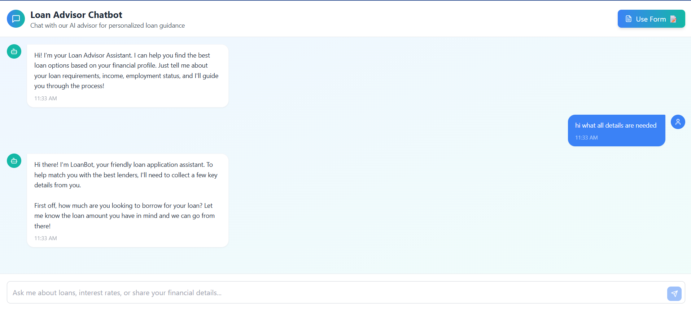

# Loan_Advisor_frontend

This is the frontend application for the Loan Advisor platform – a smart chatbot system that helps users discover the best lenders using a modern UI, machine learning predictions, and a conversational AI agent.

Chatbot Mode: Talk naturally to a loan advisor assistant powered by Claude.

Form Mode: Fill out a structured loan application to get lender recommendations.

Real-time API Integration with a FastAPI backend.

Clean UX with toggled layout and animated lender recommendation cards.

Running guide

npm install
npm run dev

Setup the .env 
Replace API_BASE_URL in .env with your production backend.

### FLOW

#### FORM

#### CHATBOT

